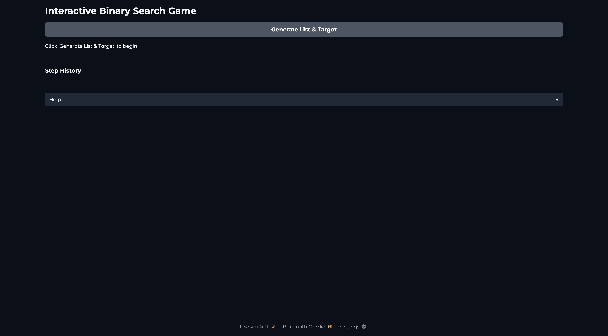
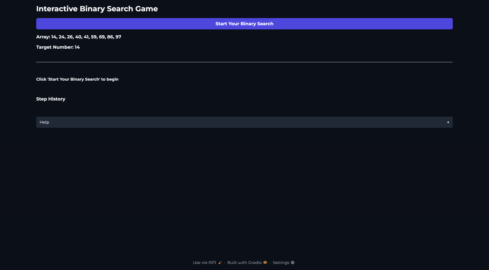
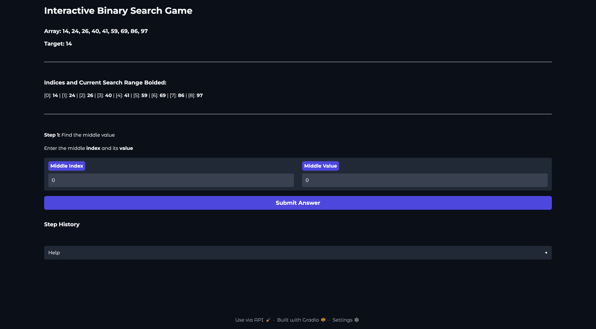
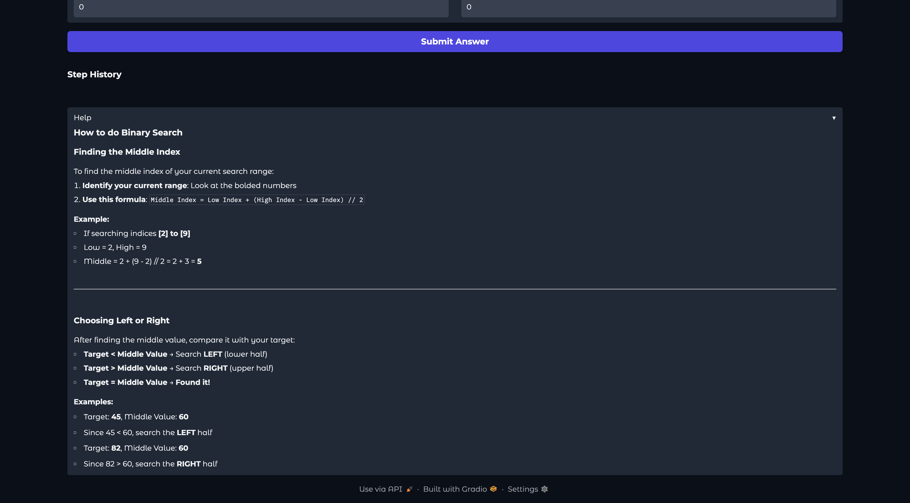
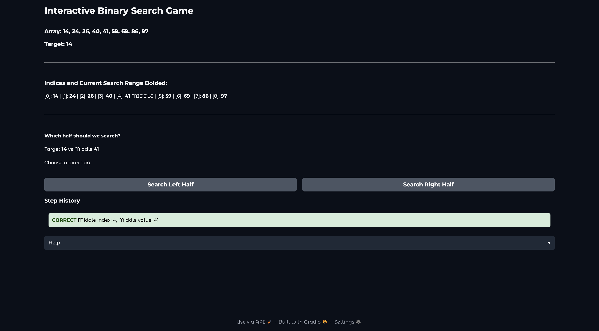
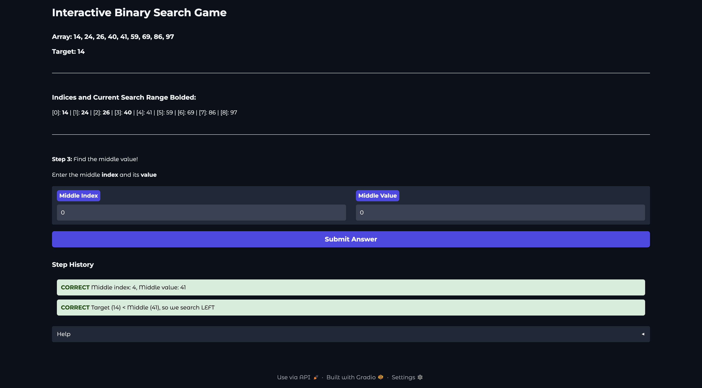
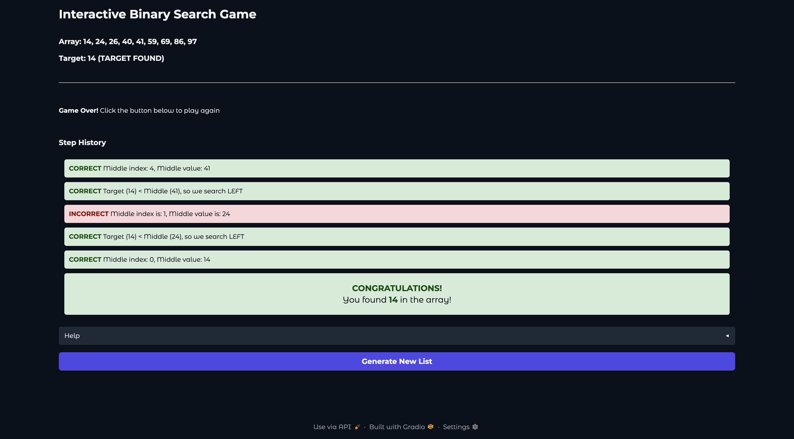

# Interactive Binary Search Game

## Demo Images









---

## Problem Breakdown & Computational Thinking

### The Four Pillars of Computational Thinking

#### **1. Decomposition**
Breaking the binary search process into smaller steps:
- Generate a random sorted array of random length (6-16) with random numbers (1-100)
- Pick a target number (may or may not be in array)
- Calculate the middle index of current search range
- Compare middle value with target
- Decide which half to search next
- Repeat until target is found or the search space is searched through

#### **2. Pattern Recognition**
Identifying the repeating pattern in binary search:
- Find the middle of current range
- Compare middle value with target
- Eliminate half of the remaining elements
- This pattern repeats until we find the target or run out of elements

#### **3. Abstraction**
Simplifying the problem by focusing on essential details:
- We only care about the current search range (low to high indices)
- We ignore elements outside our search range
- The formula `middle = low + (high - low) // 2` abstracts the calculation
- Visual feedback (green/red) outlines "correct/incorrect" without complex explanations

####  **4. Algorithm Design**
Creating a step-by-step solution:

```
1. START with full array (low = 0, high = array length - 1)

2. WHILE search range is valid (low <= high):
   a. Calculate middle index: mid = low + (high - low) // 2
   b. Get middle value from array[mid]
   
   c. IF middle value == target:
      - TARGET FOUND! End search.
   
   d. ELSE IF target < middle value:
      - Search LEFT half: high = mid - 1
   
   e. ELSE (target > middle value):
      - Search RIGHT half: low = mid + 1

3. IF loop ends and target not found:
   - TARGET NOT IN ARRAY
```

### Algorithm Complexity
- Time Complexity: O(log n) - Much faster than linear search O(n)
- Space Complexity: O(1) - Only need a few variables

---

## Hugging Face Link
**Play the live game here:** [Your Hugging Face Space URL will go here]

---

## Steps to Run Locally

### Prerequisites
- Python 3.8 or higher
- pip (Python package installer)

### Installation & Running
1. **Clone or download this repository**
   ```bash
   git clone [your-github-repo-url]
   cd binary-search-game
   ```

2. **Install dependencies**
   ```bash
   pip install -r requirements.txt
   ```

3. **Run the application**
   ```bash
   python app.py
   ```

4. **Open in browser**
   - The app will launch automatically
   - Or manually open: `http://localhost:7860`

---

## How to Play
1. **Click "Generate List & Target"** to create a random sorted array and target number
2. **Click "Start Your Binary Search"** to begin the game
3. **Find the middle index** using the formula: `Low + (High - Low) // 2`
4. **Enter the middle index and value**, then click Submit
5. **Choose a direction** (Left or Right) based on comparing target with middle value
6. **Repeat** until you find the target or determine it's not in the list

**If you Need Help:**
Click the "Help" button at the bottom of the game for instructions on how to calculate the middle index and how to decide which direction to search

---

## Author
- **Author**: Laila Wilcox 
- **Student ID**: 20520272
- **Course**: CISC-121
- **Institution**: Queen's University  
- **Semester**: Fall 2025

### Acknowledgments
- **Dr. Rahatara Ferdousi** - Course instructor
- **Gradio Team** - UI framework
- **Hugging Face** - Hosting of interactive demos
- **Queen's University Computing Science Department**

Check out the configuration reference at https://huggingface.co/docs/hub/spaces-config-reference
